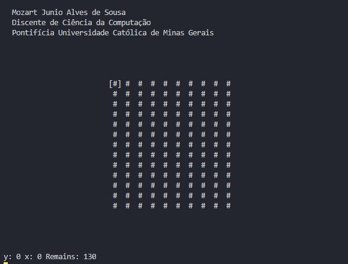

## Campo Minado em Java


---

1. O primeiro campo nunca será uma bomba ou numero;
2. O jogo acaba quando encontrar todos os campos livres de bombas.
3. Se encontrar uma bomba, você perde.
4. Como a aplicação fora desenvolvida para o terminal, não há como adicionar os eventos do Java no momento, então as entradas devem ser seguidas da tecla `ENTER`.
5. Comados: `w,a,s,d`	para movimentar-se, `espaço` para selecionar o campo. 
6. Cheats: `1` mostrará todo o campo, `2` reinicia o jogo.

- Dica: Os campos numerados indicam quantas bombas existem em seus adjacentes.
```
Ex:	!  !  !		!  _  _
        ! [8] !		# [2] _
  	!  !  !		#  !  #
```
* Legedas: '#' campos fechados, '!' Bombas, '_'campos em branco, '1-8' bombas adjacentes(ao redor).
## Observações

- Obs: Se estiver no Windows, maximize o CMD para melhor visualização.
- Obs': Se estiver em distribuições Linux, com o mouse, utilize o comando `abrir o terminal aqui` e após execute o comando `java CampoMinado`. Maximize o Terminal.
- Obs'': O campos que porventura não abrirem como deveriam no conjunto de brancos, permanecerão fechados por estarem em outra lista dinâmica de campos em branco, isso ocorre porquê a verificação entre as listas não fora feita até o momento.
